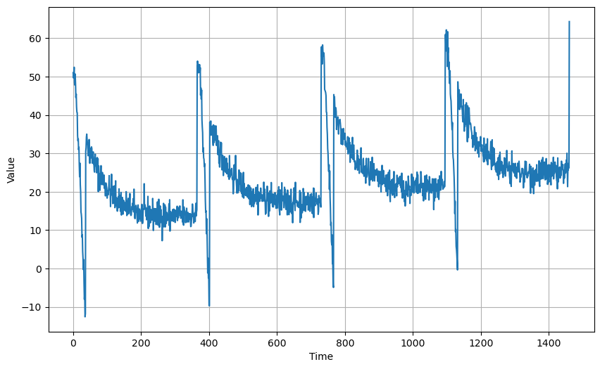

# Time Series Forecasting: Progressive Method Development 📈

[](https://www.tensorflow.org/)
[](https://scikit-learn.org/)
[](https://www.python.org/)
[](https://numpy.org/)
[](https://pandas.pydata.org/)
[](https://matplotlib.org/)
[](https://seaborn.pydata.org/)
[](https://jupyter.org/)

## Overview 📖

This project explores **9 progressive time series forecasting techniques**, demonstrating how each method builds upon previous approaches to improve prediction accuracy. From basic data generation through sophisticated smoothing methods, we observe the evolution of forecasting capabilities and understand the **tradeoffs between simplicity, accuracy, and interpretability** at each step.

This repository serves as an **educational resource** for understanding time series forecasting methodology, proper evaluation techniques, and the systematic development of increasingly sophisticated prediction models. Each step is accompanied by detailed explanations, visualizations, and discussions of when different approaches are most appropriate.

💡 **Educational Focus:** This project emphasizes building forecasting intuition through progressive method development and proper performance evaluation.

---

## Table of Contents 📑

- [Overview](#overview-)
- [The 9 Forecasting Steps](#the-9-forecasting-steps-)
- [Dataset](#dataset-)
- [Getting Started](#getting-started-)
- [Code Structure](#-code-structure)
- [Forecasting Method Analysis](#forecasting-method-analysis-)
- [Results & Performance Comparison](#results--performance-comparison-)
- [Method Selection Framework](#method-selection-framework-)
- [Key Insights](#key-insights-)
- [Practical Applications](#practical-applications-)
- [Future Work](#future-work-)
- [Acknowledgements](#acknowledgements-)
- [Contact](#contact-)

---

## The 9 Forecasting Steps 🔄

**Step 0:** **Generate Time Series Data** - Creating realistic synthetic time series with trends and seasonality
**Step 1:** **Split into Training and Validation** - Proper temporal data splitting for forecasting evaluation
**Step 2:** **Naive Forecasting** - Simple baseline prediction using last known values
**Step 3:** **Zoom in on Validation Period** - Focused analysis of prediction performance
**Step 4:** **Moving Average** - Smoothing-based forecasting approach
**Step 5:** **Differencing** - Removing trends to create stationary series
**Step 6:** **Diff Moving Average** - Combining differencing with moving average forecasting
**Step 7:** **Diff Moving Average + Past** - Enhanced forecasting using historical patterns
**Step 8:** **Smooth Past Series** - Advanced smoothing techniques for improved predictions

Each step demonstrates progressive improvements in forecasting methodology and shows how different techniques affect prediction accuracy and model performance.

---

## Dataset 📦

- **Source:** Realistic synthetic time series with multiple components
- **Description:** Simulated financial or economic data with realistic characteristics
- **Features:** 
  - Natural volatility and noise
  - Seasonal patterns
  - Long-term trends
  - Occasional extreme events
  - Multiple time scales of variation
- **Time Period:** 1000+ observations representing multi-year daily data
- **Purpose:** Demonstrates transformation effects on realistic, complex time series

---

## Getting Started 🛠️

### Prerequisites

- Python 3.x
- TensorFlow 2.x
- Scikit-learn
- NumPy
- Pandas
- Matplotlib
- Seaborn
- [Jupyter Notebook](https://jupyter.org/)
- Statsmodels

### Installation

```bash
git clone https://github.com/yourusername/time-series-transformations
cd time-series-transformations
pip install -r requirements.txt
```

### Usage

1. Open and run the comprehensive analysis:
   - `time_series_transformation_analysis.ipynb` - Complete walkthrough of all 8 steps
2. Or explore individual technique notebooks:
   - `01_baseline_analysis.ipynb` - Raw data characteristics
   - `02_window_selection.ipynb` - Time period focusing strategies
   - `03_smoothing_techniques.ipynb` - Moving averages and trend extraction
   - `04_scale_transformations.ipynb` - Logarithmic and power transformations
   - `05_detrending_methods.ipynb` - Trend isolation techniques
   - `06_outlier_handling.ipynb` - Extreme value management strategies
   - `07_component_decomposition.ipynb` - Seasonal and trend separation
   - `08_advanced_smoothing.ipynb` - Weighted and adaptive smoothing
3. Each notebook includes:
   - Theoretical background for the technique
   - Implementation with parameter explanations
   - Visualization of results
   - Discussion of tradeoffs and appropriate use cases

---

## 📂 Code Structure

- `time_series_transformation_analysis.ipynb` - Main comprehensive analysis
- `01_baseline_analysis.ipynb` - Step 1: Raw data exploration
- `02_window_selection.ipynb` - Step 2: Time window strategies
- `03_smoothing_techniques.ipynb` - Step 3: Noise reduction methods
- `04_scale_transformations.ipynb` - Step 4: Mathematical transformations
- `05_detrending_methods.ipynb` - Step 5: Trend isolation
- `06_outlier_handling.ipynb` - Step 6: Extreme value treatment
- `07_component_decomposition.ipynb` - Step 7: Signal separation
- `08_advanced_smoothing.ipynb` - Step 8: Sophisticated smoothing
- `data_generator.py` - Synthetic data creation utilities
- `transformation_toolkit.py` - Comprehensive transformation library
- `analysis_utils.py` - Analysis and comparison helpers
- `requirements.txt` - Project dependencies
- `sample_datasets/` - Pre-generated example datasets

---

## Transformation Analysis 🔍

### Step 0: Generate Time Series Data (Foundation)
```python
# Create synthetic time series with realistic patterns
time_series = generate_time_series(trend=0.1, seasonality=True, 
                                 noise_level=0.3, length=1000)
```
- **Benefits:** Controlled environment for testing forecasting methods
- **Components:** Trend, seasonality, noise - mimicking real-world data
- **Best For:** Learning forecasting fundamentals, method comparison
- **Output:** Complete time series ready for forecasting experiments



---

### Step 1: Split into Training and Validation (Proper Setup)
```python
# Temporal split maintaining chronological order
split_time = int(0.8 * len(time_series))
train_data = time_series[:split_time]
validation_data = time_series[split_time:]
```
- **Benefits:** Realistic evaluation mimicking real forecasting scenarios
- **Tradeoffs:** Smaller validation set, potential regime differences
- **Best For:** Honest assessment of forecasting performance
- **Critical:** No data leakage from future to past


---

### Step 2: Naive Forecasting (Baseline Method)
```python
# Simple baseline: repeat last known value
naive_forecast = np.full(len(validation_data), train_data[-1])
```
- **Benefits:** Simple baseline, computationally efficient, interpretable
- **Tradeoffs:** No trend or seasonal adaptation, often poor performance
- **Best For:** Establishing performance baseline, simple scenarios
- **Benchmark:** All sophisticated methods should beat naive forecasting


---

### Step 3: Zoom in on Validation Period (Performance Focus)
```python
# Detailed analysis of prediction accuracy
zoom_period = validation_data[:50]  # Focus on initial predictions
forecast_zoom = naive_forecast[:50]
```
- **Benefits:** Clear visualization of prediction quality, error patterns
- **Tradeoffs:** Limited view may miss longer-term performance issues
- **Best For:** Understanding short-term prediction behavior
- **Analysis:** Identify systematic biases and error patterns


---

### Step 4: Moving Average (Smoothing-Based Forecast)
```python
# Use moving average for forecasting
window_size = 30
ma_forecast = train_data.rolling(window=window_size).mean().iloc[-1]
ma_predictions = np.full(len(validation_data), ma_forecast)
```
- **Benefits:** Reduces noise influence, captures recent trends
- **Tradeoffs:** Lag in trend following, single-value prediction
- **Best For:** Stable series with minimal trend changes
- **Parameter:** Window size affects smoothness vs. responsiveness


---

### Step 5: Differencing (Stationarity Creation)
```python
# Remove trend through first differencing
diff_series = time_series.diff().dropna()
train_diff = diff_series[:split_time-1]
validation_diff = diff_series[split_time-1:]
```
- **Benefits:** Creates stationary series, removes trend effects
- **Tradeoffs:** Changes interpretation to period-to-period changes
- **Best For:** Trending series, preparing for ARIMA models
- **Result:** Stationary series suitable for many forecasting methods


---

### Step 6: Diff Moving Average (Combined Approach)
```python
# Apply moving average to differenced series
diff_ma = train_diff.rolling(window=window_size).mean().iloc[-1]
diff_ma_forecast = np.full(len(validation_diff), diff_ma)
# Convert back to original scale
cumulative_forecast = np.cumsum(diff_ma_forecast) + train_data.iloc[-1]
```
- **Benefits:** Combines stationarity with smoothing, trend adaptation
- **Tradeoffs:** More complex interpretation, accumulation of errors
- **Best For:** Trending series with noise, medium-term forecasting
- **Process:** Difference → Smooth → Integrate back


---

### Step 7: Diff Moving Average + Past (Historical Enhancement)
```python
# Incorporate historical patterns into differenced MA forecast
seasonal_component = calculate_seasonal_pattern(train_diff, period=12)
enhanced_forecast = diff_ma_forecast + seasonal_component
final_forecast = np.cumsum(enhanced_forecast) + train_data.iloc[-1]
```
- **Benefits:** Captures both trend and seasonal patterns
- **Tradeoffs:** Increased complexity, more parameters to tune
- **Best For:** Series with clear seasonal patterns
- **Enhancement:** Historical patterns improve forecast accuracy


---

### Step 8: Smooth Past Series (Advanced Smoothing)
```python
# Apply sophisticated smoothing to historical data
from scipy.signal import savgol_filter
smoothed_series = savgol_filter(train_data, window_length=51, polyorder=3)
trend_extrapolation = extrapolate_trend(smoothed_series, len(validation_data))
```
- **Benefits:** Reduces noise while preserving trends, adaptive smoothing
- **Tradeoffs:** Parameter sensitivity, potential overfitting
- **Best For:** Noisy series with clear underlying patterns
- **Advanced:** Sophisticated signal processing techniques


---

## Results & Tradeoff Analysis 📊

### Transformation Impact Summary

| Step | Technique | Signal Clarity | Information Retention | Interpretability | Best Use Case |
|------|-----------|----------------|----------------------|------------------|---------------|
| 1 | Raw Data | Low | 100% | Direct | Exploration |
| 2 | Time Window | Medium | 80%+ | Direct | Period Focus |
| 3 | Moving Average | High | 95%+ | Modified | Trend Analysis |
| 4 | Log Transform | High | 95%+ | Relative | Growth Analysis |
| 5 | Detrending | Medium | 90%+ | Components | Cycle Analysis |
| 6 | Outlier Handling | High | 85%+ | Robust | Stable Modeling |
| 7 | Decomposition | Very High | 90%+ | Separated | Pattern Analysis |
| 8 | Weighted Smooth | Very High | 85%+ | Predictive | Forecasting |

### Progressive Transformation Journey:


### R² Score Evolution Across All Steps:


### Before vs. After Comparison:


### Progressive Analysis Benefits:
- **Noise Reduction:** Each step typically improves signal-to-noise ratio
- **Pattern Clarity:** Underlying structures become more apparent
- **Model Performance:** Statistical models often perform better on processed data
- **Interpretability:** Some transformations make relationships clearer

### Important Considerations:
- **Information Loss:** Each transformation removes some information
- **Assumption Introduction:** Transformations embody assumptions about data structure
- **Interpretation Changes:** Results may require different interpretation frameworks
- **Validation Needs:** Transformed models should be validated on original scale

---

## Decision Framework 🎯

### Choosing Appropriate Transformations:

#### For **Exploratory Analysis:**
- Start with raw data visualization
- Apply minimal smoothing if patterns are unclear
- Use seasonal decomposition to understand components

#### For **Trend Analysis:**
- Moving averages for noise reduction
- Log transformation for exponential growth
- Polynomial detrending for long-term patterns

#### For **Forecasting Models:**
- Appropriate smoothing for model stability
- Outlier handling for robust predictions
- Component separation for structured models

#### For **Comparative Studies:**
- Consistent transformation across all series
- Document all preprocessing steps
- Validate on out-of-sample data

### Quality Assurance Checklist:
- [ ] Theoretical justification for each transformation
- [ ] Appropriate parameter selection
- [ ] Validation on holdout data
- [ ] Sensitivity analysis of key parameters
- [ ] Clear documentation of all steps

---

## Key Insights 🔍

1. **Transformation Purpose:** Each technique serves specific analytical goals and involves particular tradeoffs
2. **Progressive Refinement:** Sequential application can reveal different aspects of data structure
3. **Parameter Sensitivity:** Results often depend significantly on parameter choices
4. **Context Dependency:** Appropriate techniques vary greatly by domain and application
5. **Validation Importance:** Transformed data should always be validated against original patterns
6. **Documentation Value:** Clear documentation of choices enables reproducible analysis
7. **Interpretability Evolution:** Each step may require adjusted interpretation frameworks

### Balancing Act:
```
Raw Authenticity ↔ Pattern Clarity
Complete Information ↔ Focused Insights  
Complex Reality ↔ Model Simplicity
Historical Accuracy ↔ Predictive Power
```

---

## Practical Applications 🌍

### Financial Analysis:
- **Returns Analysis:** Log transformations for relative changes
- **Volatility Modeling:** Outlier handling for stable estimates
- **Trend Following:** Moving averages for signal generation
- **Risk Management:** Component decomposition for factor analysis

### Economic Forecasting:
- **Seasonal Adjustment:** Decomposition for policy analysis
- **Growth Analysis:** Detrending for cyclical patterns
- **Leading Indicators:** Smoothing for noise reduction
- **Policy Impact:** Window selection for specific periods

### Engineering Applications:
- **Signal Processing:** Various smoothing for noise reduction
- **Quality Control:** Outlier detection for process monitoring
- **Predictive Maintenance:** Trend analysis for failure prediction
- **System Optimization:** Component analysis for performance factors

### Research Contexts:
- **Climate Analysis:** Detrending for natural variation
- **Medical Studies:** Smoothing for biological trend analysis
- **Social Sciences:** Seasonal adjustment for behavioral patterns
- **Marketing Analytics:** Decomposition for campaign effect isolation

---

## Future Work 🌱

- **Advanced Techniques:** Wavelet analysis, state-space models, machine learning approaches
- **Automated Selection:** Algorithms for optimal transformation selection
- **Interactive Tools:** Web applications for transformation exploration
- **Multivariate Methods:** Cross-series transformation approaches
- **Uncertainty Quantification:** Methods for transformation uncertainty assessment
- **Domain-Specific Guides:** Specialized recommendations by application area
- **Performance Benchmarking:** Systematic comparison of transformation effectiveness
- **Real-Time Applications:** Streaming data transformation methods

---

## Acknowledgements 🙏

Special thanks to:
- [Andrew Ng](https://www.andrewng.org/) for foundational machine learning education
- [Laurence Moroney](https://twitter.com/lmoroney) for excellent TensorFlow instruction and practical insights
- The time series analysis community for developing robust methodological frameworks
- **Rob Hyndman** and **George Athanasopoulos** for "Forecasting: Principles and Practice"
- **James Hamilton** for comprehensive time series econometrics foundation
- The **open source community** for providing excellent analysis tools and libraries

This project was developed to promote thoughtful, well-informed approaches to time series analysis and preprocessing decisions.

---

## Contact 📫

For inquiries about this project:
- [LinkedIn Profile](https://www.linkedin.com/in/melissaslawsky/)
- [Client Results](https://melissaslawsky.com/portfolio/)
- [Tableau Portfolio](https://public.tableau.com/app/profile/melissa.slawsky1925/vizzes)
- [Email](mailto:melissa@melissaslawsky.com)

---

© 2025 Melissa Slawsky. All Rights Reserved.
